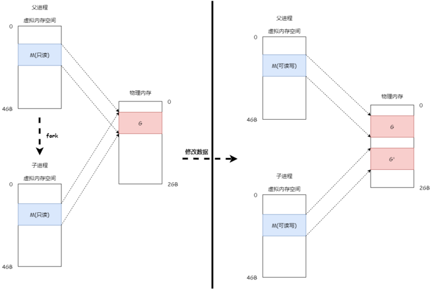

### 1.array 

1.第一种方法：

```c_cpp
int array[3]；//声明 decalre
for(int i =0; i<3; i++){
  array [i] = i; // initialize 初始化
}
```

2.第二种方法使用指针

```c_cpp
int *array2 = malloc(sizeof(int)*NUM_ELEMENT);
printf('array2: %x\n',array2);
for(int i 0; i< NUM_ELEMENTS; ++i){
  *(arr2+i)=i;
  printf("(arr2 + %d):%x\n", i, arr2+i);
}
Output:
arr2: 0x10008000
(arr2 + 0): 0x10008000
(arr2 + 1): 0x10008004
(arr2 + 2): 0x10008008
```

***

### 3.C语言是过程化的编程语言，程序执行顺序是从上到下。函数调用需要先声明后调用。

***

### 4. `malloc（）` 	内存分配函数 void *(unsigned long)

It returns a pointer to the start of a region of memory on the heap. It takes in the number of bytes to allocate.

***

### 5.struct() 函数 类似java中class

When we have a pointer to a struct we can use the arrow syntax to quickly reference its fields    `c2->y = 4;`

***

### 6.vim 	撤销键

使用“U"撤销操作； “control+r”撤销 “撤销”

***

### 7.解析getopt ,optind 

很详细的解读 茅塞顿开：

 [https://blog.csdn.net/ahafg/article/details/53332342](https://)

***

### 8.双指针 double pointer 

***

### 9.GDB操作

[http://c.biancheng.net/view/8189.html](https://)

file指定目标程序

set 设置启动参数

run （以代码行为单位）或者start（函数为单位）执行程序

使用next 按单位运行程序 

find 可以找到内存中的具体内容

参考：[https://undo.io/resources/gdb-watchpoint/how-search-byte-sequence-memory-gdb-command-find/](https://)

```
find [/SIZE-CHAR] [/MAX-COUNT] START-ADDRESS, END-ADDRESS, EXPR1 [, EXPR2, ...]
(gdb) info proc mappings
(gdb) find 0x555555554000, 0x555555558fff, “Hello, world!”
```

想要进入`subroutine`，例如某函数内部，则使用`step`进入

想要退出`subroutine`，则使用finish（结束stack frame）退出

添加断点使用break + 行号/ 函数名

查看寄存器的值 `info registers`

查看栈的调用使用：`where`

 [https://www.cse.unsw.edu.au/~learn/debugging/modules/gdb_call_stack/](https://)

查看当前线程信息 使用 `i threads`

o 查看文件

<br/>

<br/>

2.objdump使用： objdump命令是Linux下的反汇编目标文件或者可执行文件的命令，它以一种可阅读的格式让你更多地了解二进制文件可能带有的附加信息。

[https://cloud.tencent.com/developer/article/1494510](https://)

[https://blog.csdn.net/pansaky/article/details/88656420](https://)

***

### 10.堆heap与栈stack的区别

一、栈
我们经常说的数据结构堆栈，其实指的就是栈，它是一种先进后出的数据结构，从管理角度来讲，它是由操作系统自动分配管理的，也就是说它是规整的，内存的大小在申请之后不会发生变化。因此，它不会出现碎片化，并且读取速度非常的快。什么样的数据存放到栈里面呢？我们经常声明的局部变量，一些基本数据类型，比如int，double，short，char等，这些数据在声明的时候，内存的大小已经确定，它们会被存放到栈中。使用栈的好处是，不需要程序员管理内存的释放，这些内存会由操作系统自动释放，比如我们运行的一些函数，当函数结束的时候，它内部的变量申请的内存空间就会被自动释放。

二、堆
相比于栈的固定大小，堆的分配非常自由，它是由程序员自己去分配的，比如程序员考虑到某些情况需要更多的内存，它就可以在堆上面申请一个足够大的内存。除此之外，内存的分配非常自由，它并不要求是连续的内存，只要有空间，都可以被拿来分配。不过这样就会导致产生很多碎片，不利于高速读取，因此堆的操作的速度要比栈慢很多。堆主要存放的是大小不固定的内存结构，因此，我们的数组和结构体经常被存放到堆上。对于全局变量我们也会放到堆上，因为它需要可以被任何地方访问，并且不能像栈一样被操作系统回收
————————————————

原文链接：https://blog.csdn.net/weixin_34481217/article/details/125312209

***

### 10.从源码到可执行文件1.以recurse.c文件为例子

`gcc -m32 -c recurse.c -o recurse.o`C语言编译的几个命令 及解释：

1. x86是由英特尔开发的指令集架构（ISA）。这是属于复杂指令集（CISC），与精简指令集（RISC）相反。 前提： 我的虚拟机是 32 bit x86 架构，称为i386或 IA-32。
2.  -c 与-S的区别

- -c是调用编译器compiler和汇编器assembler
- -S仅仅调用编译器 compiler 来生成汇编码 eg. map.S compiled code

3. gcc -m32 -S -o map.S map.c 
   
   -m32代表 编译该代码为i386架构下
   
   `offset(base, index, scale)` means `base + index * scale + offset`
   
   `mov %ecx, -4(%esi, %ebx, 8)` means` Move contents in ecx into address esi + 8 * ebx - 4`

***

### 11.关于 %0, %1 ,%%eax的含义

[https://gcc.gnu.org/onlinedocs/gcc/Extended-Asm.html](https://)

`print/x if_` 打印寄存器情况在运行 if_结构后

### 12.exec()函数

exec（可运行文件名）会用新进程取代当前进程

### 13.pthread_yield()

使当前线程从执行状态（运行状态）变为可执行态（就绪状态）。cpu会从众多的可执行态里选择，也就是说，当前也就是刚刚的那个线程还是有可能会被再次执行到的，并不是说一定会执行其他线程而该线程在下一次中不会执行到了。

打个比方：现在有很多人在排队上厕所，好不容易轮到这个人上厕所了，突然这个人说：“我要和大家来个竞赛，看谁先抢到厕所！”，然后所有的人在同一起跑线冲向厕所，有可能是别人抢到了，也有可能他自己有抢到了。我们还知道线程有个优先级的问题，那么手里有优先权的这些人就一定能抢到厕所的位置吗? 不一定的，他们只是概率上大些，也有可能没特权的抢到了。
————————————————
版权声明：本文为CSDN博主「dabing69221」的原创文章，遵循CC 4.0 BY-SA版权协议，转载请附上原文出处链接及本声明。
原文链接：https://blog.csdn.net/dabing69221/article/details/17426953

***

### 14.pthread_join(线程名)

该函数相当于waitpid(3).即等待线程3结束，再运行本地的线程。

***

### 15.fork()函数中写时复制（Copy On Write）COW

虚拟内存和物理内存的变化



#### 